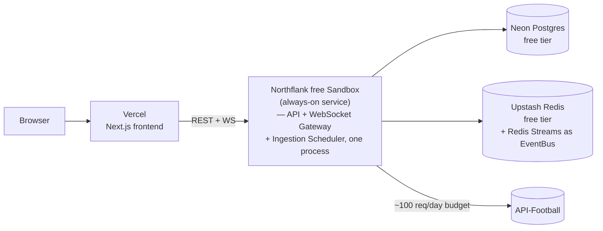
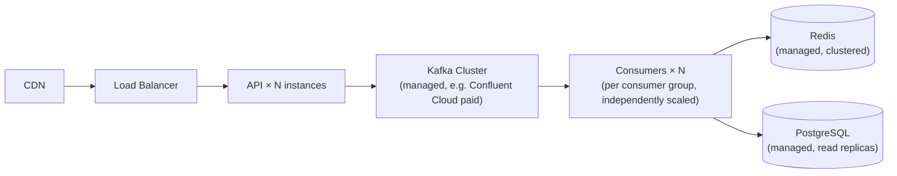

# ADR-008: Free Deployment Strategy

**Status:** Accepted
**Date:** 2026-09-06
**Related:** [deployment.md](../deployment.md), [scalability.md](../scalability.md), [ADR-003](ADR-003-kafka-architecture.md)

## Context

The project must run at €0/month (§18) as a reliable public demo. This
requires picking real, currently-available free tiers — not assuming a
provider is free without checking (the same discipline as ADR-001) — and
being explicit about what a paid Production Mode would look like instead
(§19).

Infra checked as of September 2026:

| Component | Candidate | Free tier reality |
|---|---|---|
| Postgres | Neon | 100 CU-hrs/mo, 0.5GB storage/project, scale-to-zero — sufficient for portfolio data volume |
| Cache/live state | Upstash Redis | 256MB, 500k commands/mo, HTTP-based (works from serverless) |
| Event bus | Upstash Kafka | **Discontinued** (deprecated Sep 2024, shut down Mar 2025) — not usable |
| Event bus | Confluent Cloud | Free tier is a $400 promotional credit, not perpetual — not usable as an always-on free tier |
| Frontend | Vercel | Free tier for Next.js; no persistent WebSocket support in serverless functions |
| Backend host (needs to stay up for WS + polling) | Render free | Sleeps after 15 min idle — breaks persistent WebSocket connections and the polling scheduler |
| Backend host | Railway | No free tier (credit-based trial only) |
| Backend host | Fly.io | No free tier for new accounts |
| Backend host | Koyeb free | Scales to zero after 1h idle; free tier's future is uncertain post-acquisition |
| Backend host | **Northflank free Sandbox** | **2 always-on services, no sleep** — the only checked option that stays up continuously for €0 |

## Decision

### Portfolio Mode topology (€0/month)

- **Ingestion, API, and WebSocket gateway run as one Node process** inside a
  single Northflank free service, rather than three separate services — the
  free Sandbox tier allows 2 always-on services total, and splitting further
  buys nothing at this traffic level. This is stated as a deliberate
  Portfolio Mode simplification, not the target architecture (see
  Production Mode below).
- **Event bus is Redis Streams**, not Kafka, in this deployment (ADR-003) —
  because no always-on free hosted Kafka exists. Real Kafka runs via Docker
  Compose for local development and is documented as what Production Mode
  uses.
- **Frontend on Vercel** — static/SSR Next.js has no need to stay "always
  on" the way a WebSocket server does, so Vercel's serverless free tier is
  a good fit for it specifically, even though it's a poor fit for the
  backend.

### Production Mode topology (documented, not built)

Differences from Portfolio Mode, and why each one is a paid-tier problem
rather than an architecture problem:
- Kafka replaces Redis Streams as the `EventBus` implementation — no code
  change, only `EVENT_BUS_DRIVER=kafka` plus a managed Kafka endpoint.
- API and consumers scale horizontally behind a load balancer — the
  WebSocket fan-out design (ADR-006) and consumer-group design (ADR-003)
  were built to support this from the start, so this is a deployment change,
  not a redesign.
- Postgres gets read replicas once read volume from the dashboard/API
  exceeds a single instance comfortably — the schema (ADR-005) doesn't
  change.
- API-Football's paid tiers raise the request budget, which only changes
  `LIVE_POLL_INTERVAL_MS` (ADR-002), not the polling architecture.

Full detail on what changes at each scaling stage is in
[scalability.md](../scalability.md).

## Consequences

**Positive**
- Every component in Portfolio Mode is a real, currently-available free
  tier, verified against current docs (not assumed) — the deployment can
  actually be built and will actually still be free next month.
- The Portfolio → Production path is a config/infra change at every layer
  that was checked, not a rewrite — this is the direct payoff of ADR-003's
  `EventBus` abstraction and ADR-007's provider abstraction.

**Negative / accepted constraints**
- Northflank's free Sandbox is the single load-bearing assumption in this
  whole topology — if its terms change, the backend hosting decision needs
  revisiting (a self-hosted low-spec VM, e.g. Oracle Cloud's reduced-but-
  still-free Ampere tier, would be the fallback, at the cost of losing
  managed-platform conveniences).
- Combining ingestion + API + WebSocket gateway into one process in
  Portfolio Mode means they share fate (a crash takes down all three) —
  explicitly accepted as a Portfolio Mode-only tradeoff, reversed in
  Production Mode where they're separate, independently-scaled services.

## Addendum (2026-09-09): what actually happened when this was deployed for real

This ADR's own risk section named the exact failure mode that materialized:
"Northflank's free Sandbox is the single load-bearing assumption... if its
terms change, the backend hosting decision needs revisiting (a self-hosted
low-spec VM, e.g. Oracle Cloud's... Ampere tier, would be the fallback)."
That's precisely what happened — documented here because "we verified this
works" and "we verified this works until we actually tried it" are
different claims, and only real deployment proves the second one.

**Northflank and Render both required a credit card to actually deploy a
service, despite being widely described (including in this project's own
Phase 1/2 research and numerous 2026 blog posts checked again during
deployment) as "no credit card required."** That claim is true for account
signup; it is not true for creating a running service — both platforms'
APIs returned an explicit payment-required error the moment service
creation was attempted, on real accounts confirmed to be on their free
tiers. This is a real, current (as of September 2026) tightening — plausibly
industry-wide anti-abuse policy — that generic "is X free?" research
(including this project's own) will keep getting wrong until someone
actually tries to deploy, not just signs up.

**The fallback — a real Oracle Cloud Always Free Ampere A1 VM — worked**,
with caveats:
- Also requires a card for identity verification (a temporary hold, not a
  functional deployment blocker like the two platforms above) — a
  meaningfully different, more honest kind of "free."
- Oracle quietly halved the Always Free Ampere allowance (4 OCPU/24GB → 2
  OCPU/12GB) in June 2026 with no announcement, and some existing users'
  instances were shut down without warning when that happened. The
  remaining allowance is still generous for this project's footprint, but
  it's a documented signal that "always free" here has a track record of
  being unilaterally reduced — a different risk than Render's predictable,
  documented sleep-on-idle behavior. Accepted anyway, deliberately, in
  exchange for genuine always-on compute with no functional card paywall.
- Self-hosting on a bare VM (not a PaaS) meant handling everything a
  managed platform would otherwise absorb: Docker installed manually;
  **two separate firewall layers** discovered the hard way (the VM's own
  iptables rejected everything but SSH by default, *and* Oracle's
  cloud-level Security List needed its own matching ingress rules — fixing
  only one looked like progress but changed nothing externally); a
  Security List rule entered with source/destination ports backwards
  (`Destination Port Range: All` instead of `80`) that silently passed
  console validation and had to be diagnosed by testing raw TCP
  reachability from outside, not by trusting "the rule is there"; and TLS,
  which a PaaS gives for free — solved with Caddy's automatic Let's
  Encrypt provisioning against a free `nip.io` wildcard domain mapped to
  the VM's public IP, needing no purchased domain at all.
- **Vercel's GitHub App integration could not be authorized via API token
  alone** — connecting a repo for deploy-on-push needs an interactive
  OAuth-style authorization Vercel's CLI/API doesn't expose to a bare
  token. Deployed directly from the built output instead (`vercel --prod`),
  which produces an identical live result but means deploy-on-push isn't
  wired up yet — a documented gap, not a silent one.

**A real operational lesson, not a code bug**: running a local dev backend
against the same `API_FOOTBALL_KEY` as the newly-deployed production
backend, on the same day, split the shared 100-request/day quota between
two independent pollers — production's live tier exhausted its category
budget faster than ADR-002's math assumed a *single* poller would. The
system's own reliability design (§22/§23) handled this exactly as
intended — matches kept their last-known state and the UI correctly showed
"data may be stale" rather than pretending to be current — which is itself
a genuine, unplanned, real-world proof that the staleness-honesty design
actually works under real degraded conditions, not just in a test. The
practical fix is operational, not architectural: don't run local dev
polling against the same key as a live production deployment on the same
day, or use separate keys for each.

**What this validates about the rest of the architecture**: every piece
built *before* deployment — the Dockerfile, the migration-on-boot strategy,
`EVENT_BUS_DRIVER=redis-streams`, the Neon/Upstash connection strings, the
CORS/`FRONTEND_ORIGIN` handling — worked correctly on the first real boot
against a genuinely fresh database, with exactly one real bug surfaced (the
standings/league-season ordering dependency, its own fix documented at the
call site in `ingestionService.ts` and in the ADR-007 addendum's sibling
commit). The infrastructure-shopping problems above were about which
free-tier platform would actually let deployment happen at all, not about
whether this project's own code was ready for it.
