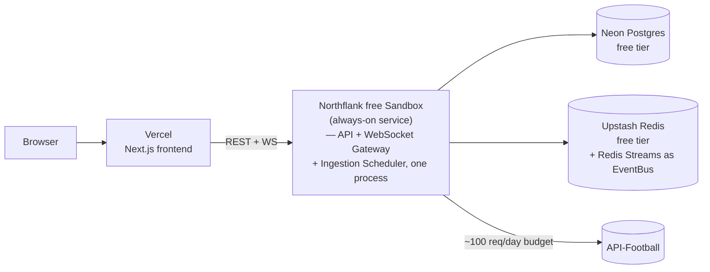
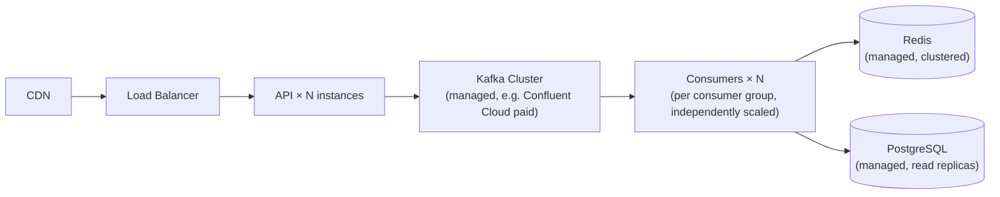

# ADR-008: Free Deployment Strategy

**Status:** Accepted
**Date:** 2026-09-06
**Related:** [deployment.md](../deployment.md), [scalability.md](../scalability.md), [ADR-003](ADR-003-kafka-architecture.md)

## Context

The project must run at €0/month (§18) as a reliable public demo. This
requires picking real, currently-available free tiers — not assuming a
provider is free without checking (the same discipline as ADR-001) — and
being explicit about what a paid Production Mode would look like instead
(§19).

Infra checked as of September 2026:

| Component | Candidate | Free tier reality |
|---|---|---|
| Postgres | Neon | 100 CU-hrs/mo, 0.5GB storage/project, scale-to-zero — sufficient for portfolio data volume |
| Cache/live state | Upstash Redis | 256MB, 500k commands/mo, HTTP-based (works from serverless) |
| Event bus | Upstash Kafka | **Discontinued** (deprecated Sep 2024, shut down Mar 2025) — not usable |
| Event bus | Confluent Cloud | Free tier is a $400 promotional credit, not perpetual — not usable as an always-on free tier |
| Frontend | Vercel | Free tier for Next.js; no persistent WebSocket support in serverless functions |
| Backend host (needs to stay up for WS + polling) | Render free | Sleeps after 15 min idle — breaks persistent WebSocket connections and the polling scheduler |
| Backend host | Railway | No free tier (credit-based trial only) |
| Backend host | Fly.io | No free tier for new accounts |
| Backend host | Koyeb free | Scales to zero after 1h idle; free tier's future is uncertain post-acquisition |
| Backend host | **Northflank free Sandbox** | **2 always-on services, no sleep** — the only checked option that stays up continuously for €0 |

## Decision

### Portfolio Mode topology (€0/month)

- **Ingestion, API, and WebSocket gateway run as one Node process** inside a
  single Northflank free service, rather than three separate services — the
  free Sandbox tier allows 2 always-on services total, and splitting further
  buys nothing at this traffic level. This is stated as a deliberate
  Portfolio Mode simplification, not the target architecture (see
  Production Mode below).
- **Event bus is Redis Streams**, not Kafka, in this deployment (ADR-003) —
  because no always-on free hosted Kafka exists. Real Kafka runs via Docker
  Compose for local development and is documented as what Production Mode
  uses.
- **Frontend on Vercel** — static/SSR Next.js has no need to stay "always
  on" the way a WebSocket server does, so Vercel's serverless free tier is
  a good fit for it specifically, even though it's a poor fit for the
  backend.

### Production Mode topology (documented, not built)

Differences from Portfolio Mode, and why each one is a paid-tier problem
rather than an architecture problem:
- Kafka replaces Redis Streams as the `EventBus` implementation — no code
  change, only `EVENT_BUS_DRIVER=kafka` plus a managed Kafka endpoint.
- API and consumers scale horizontally behind a load balancer — the
  WebSocket fan-out design (ADR-006) and consumer-group design (ADR-003)
  were built to support this from the start, so this is a deployment change,
  not a redesign.
- Postgres gets read replicas once read volume from the dashboard/API
  exceeds a single instance comfortably — the schema (ADR-005) doesn't
  change.
- API-Football's paid tiers raise the request budget, which only changes
  `LIVE_POLL_INTERVAL_MS` (ADR-002), not the polling architecture.

Full detail on what changes at each scaling stage is in
[scalability.md](../scalability.md).

## Consequences

**Positive**
- Every component in Portfolio Mode is a real, currently-available free
  tier, verified against current docs (not assumed) — the deployment can
  actually be built and will actually still be free next month.
- The Portfolio → Production path is a config/infra change at every layer
  that was checked, not a rewrite — this is the direct payoff of ADR-003's
  `EventBus` abstraction and ADR-007's provider abstraction.

**Negative / accepted constraints**
- Northflank's free Sandbox is the single load-bearing assumption in this
  whole topology — if its terms change, the backend hosting decision needs
  revisiting (a self-hosted low-spec VM, e.g. Oracle Cloud's reduced-but-
  still-free Ampere tier, would be the fallback, at the cost of losing
  managed-platform conveniences).
- Combining ingestion + API + WebSocket gateway into one process in
  Portfolio Mode means they share fate (a crash takes down all three) —
  explicitly accepted as a Portfolio Mode-only tradeoff, reversed in
  Production Mode where they're separate, independently-scaled services.
