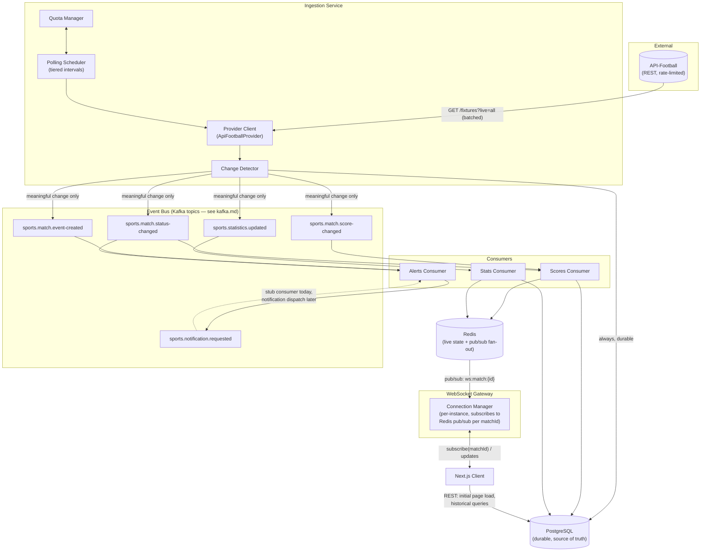
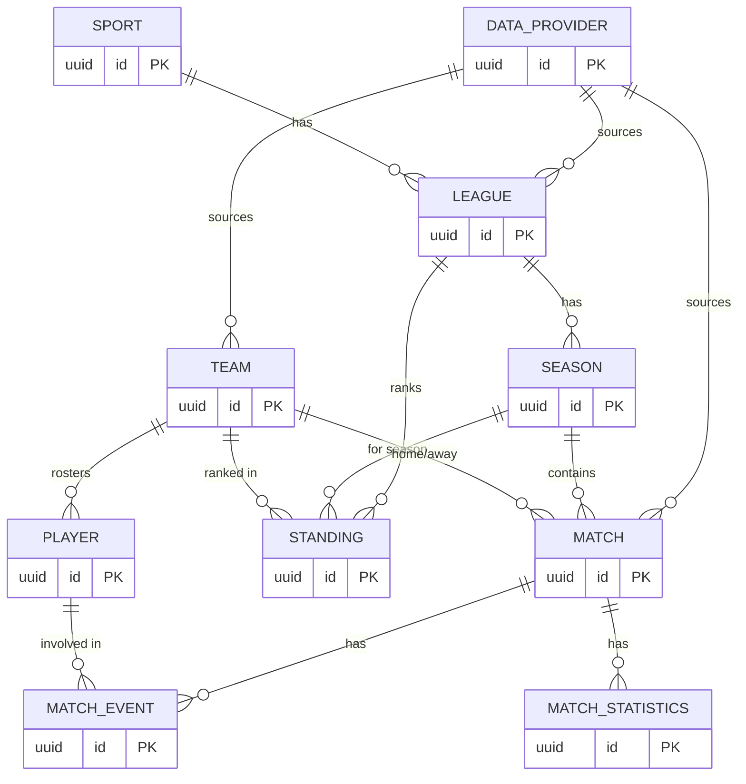

# Architecture Overview

**Status:** Phase 2 design — not yet implemented (see [README](../README.md) for phase status)

This document is the map. Each subsystem has its own doc with implementation
detail; the decisions behind each are in `docs/adr/`.

## 1. System diagram

## 2. Why this shape (one-paragraph versions — full reasoning in each ADR)

- **Ingestion is its own service**, separate from the API the browser talks
  to, so the external provider's quirks, rate limits, and downtime never
  reach the client directly (§4 requirement) — see [data-provider.md](data-provider.md) and [ingestion.md](ingestion.md).
- **Change detection sits between ingestion and the event bus** so the same
  provider response polled ten times produces at most one event, not ten —
  see [change-detection.md](change-detection.md).
- **Kafka decouples "detecting a change" from "doing something about it."**
  Scores, stats, and alerts are different consumers with different
  failure/retry needs; a slow stats consumer must never block score updates
  reaching the browser. This is a deliberate demonstration of the pattern,
  not one this specific request volume requires — see
  [ADR-003](adr/ADR-003-kafka-architecture.md) and
  [technical-decisions.md §1](technical-decisions.md#1-kafka-is-a-deliberate-demonstration-choice-not-one-this-workload-demands).
- **Redis sits between Kafka consumers and the WebSocket gateway**, not just
  as a cache. Consumers never hold client connections; they write state and
  publish to a pub/sub channel. The gateway fans that out to whichever
  clients are actually subscribed. This is what lets the gateway scale
  horizontally later without consumers knowing how many gateway instances
  exist — see [ADR-006](adr/ADR-006-websocket-architecture.md).
- **PostgreSQL is the only thing anything is willing to lose data over.**
  Redis and Kafka can both fail or be flushed; Postgres is written
  synchronously by the ingestion service (not just by consumers) so durable
  history never depends on the event pipeline being healthy — see
  [ADR-005](adr/ADR-005-postgresql-schema.md).

## 3. Domain model

Provider-independence is structural, not aspirational: every row sourced
from an external API carries `(provider_id, external_id)`, and nothing else
in the schema references a provider's ID format directly.

Full column-level schema (types, constraints, indexes) is in
[ADR-005](adr/ADR-005-postgresql-schema.md).

## 4. Data flow: "a goal happens" end to end

This is the walkthrough worth memorizing before an interview about this
project — it's the one scenario that touches every component.

1. **Polling Scheduler** ticks (every 3–5 min in Portfolio Mode, see
   [ADR-002](adr/ADR-002-polling-strategy.md) for why that number, not 30s).
2. **Provider Client** calls `GET /fixtures?live=all` — one request,
   regardless of how many matches are live worldwide. **Quota Manager**
   records the response's `x-ratelimit-*` headers into Redis `api:quota`.
3. Response is mapped from API-Football's shape into the internal `Match`
   domain model (`ApiFootballProvider`, behind `SportsDataProvider` — see
   [data-provider.md](data-provider.md)).
4. **Change Detector** compares the mapped match against the last known
   state (Redis `live:match:{id}` first, Postgres as fallback). Home score
   went from 1 to 2 → this is a real change.
5. Two things happen, both synchronously in the ingestion service, neither
   depending on the other succeeding:
   - `MatchEvent` (goal) and updated `Match` row are written to **PostgreSQL** — durable, source of truth, happens even if Kafka is down.
   - `sports.match.score-changed` and `sports.match.event-created` are published to **Kafka** (or Redis Streams in Portfolio Mode — see [ADR-008](adr/ADR-008-free-deployment-strategy.md)), keyed by `matchId` (see [kafka.md](kafka.md)).
6. **Scores Consumer** (consumer group `scores-consumer-group`) reads the
   score-changed event, updates Redis `live:match:{id}` and `live:matches`,
   then `PUBLISH`es to Redis channel `ws:match:{id}`.
7. **Alerts Consumer** reads the event-created event, decides a goal is
   notification-worthy, and publishes to `sports.notification.requested`
   (consumed today by a logging stub — this is the seam future push/email
   notifications attach to, per §29; nothing more is built now).
8. **WebSocket Gateway** instances subscribed to `ws:match:{id}` (because
   they have at least one local client subscribed to that match) receive the
   pub/sub message and push `{type: "match:update", ...}` and
   `{type: "match:event", ...}` to those clients — see
   [websocket.md](websocket.md).
9. **Browser** updates the scoreline and timeline without a refresh.

Latency budget for this path (goal → browser) is dominated by step 1's
polling interval, not by Kafka/Redis/WebSocket hops (each adds low
single-digit milliseconds) — which is the honest, important caveat: on the
free tier, "real-time" means "as fresh as the last poll," typically a few
minutes, and the UI says so (§23, see [caching.md](caching.md)).

## 5. Deployment topology (summary — full detail in [deployment.md](deployment.md))

Portfolio Mode (€0/month) and Production Mode are different topologies for
the *same* application code — see [ADR-008](adr/ADR-008-free-deployment-strategy.md)
and [scalability.md](scalability.md) for exactly what changes and why.

## 6. ADR index

| ADR | Decision |
|---|---|
| [001](adr/ADR-001-sports-api-selection.md) | Sports API selection — API-Football |
| [002](adr/ADR-002-polling-strategy.md) | REST polling strategy |
| [003](adr/ADR-003-kafka-architecture.md) | Kafka architecture |
| [004](adr/ADR-004-redis-strategy.md) | Redis strategy |
| [005](adr/ADR-005-postgresql-schema.md) | PostgreSQL schema |
| [006](adr/ADR-006-websocket-architecture.md) | WebSocket architecture |
| [007](adr/ADR-007-provider-abstraction.md) | Provider abstraction |
| [008](adr/ADR-008-free-deployment-strategy.md) | Free deployment strategy |
