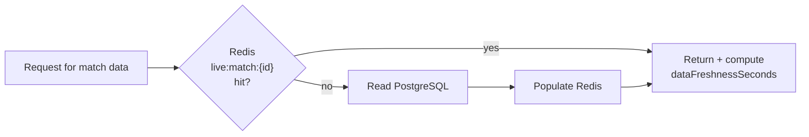

# Caching Strategy

Decision and rationale: [ADR-004](adr/ADR-004-redis-strategy.md). This doc
covers the read-path behavior that ties Redis, Postgres, and the frontend's
data-freshness UI together.

## Read path (cache-aside)

Every response — whether served from Redis or from the Postgres fallback —
carries `lastUpdatedAt` and a computed `dataFreshnessSeconds`. This is
non-negotiable: the frontend must always be able to render a freshness
indicator, never just "the data," so §23 is enforced at the API layer, not
left to individual frontend components to remember.

## Freshness thresholds (default, configurable)

| `dataFreshnessSeconds` | UI treatment |
|---|---|
| < 90s | "Updated Ns ago" — normal, unobtrusive |
| 90s – 300s | "Updated Ns ago" with subtle visual de-emphasis | 
| > 300s (i.e. worse than one missed live poll cycle, ADR-002) | "⚠ Data may be stale — last successful update: Ns ago" — explicit banner, not just muted text |

90 seconds is tuned to sit comfortably under the ~5-minute live polling
interval (ADR-002) without false-alarming on normal poll-to-poll gaps; 300s
(one full missed cycle) is where the UI stops implying the data is current
and says so.

## Invalidation

There is no time-based invalidation of `live:match:{id}` while a match is
live — see ADR-004 for why (change detection, not TTL, keeps it correct).
The only invalidation event is a match reaching a final status, at which
point the key is retained for a grace period (default 1h, for viewers who
loaded the page just before full-time) and then expired — Postgres is
authoritative for anything older.

## Redis failure behavior

Covered in full in [ADR-004](adr/ADR-004-redis-strategy.md#redis-failure-behavior).
Summary: reads fall back to Postgres (slower, correct); writes to Postgres
are unaffected; live push via WebSocket degrades until Redis recovers, and
clients fall back to their own polling (ADR-006). None of this is a crash
path — it's a documented, tested degradation.

## What's measured (feeds §21/§15)

- `redis_cache_hits` / `redis_cache_misses` — the literal hit rate, shown on
  the ops dashboard.
- Cache hit rate is expected to be high for `live:match:{id}` (written by
  consumers on every real change, read far more often than it's written)
  and near-irrelevant for `api:quota` (always fresh by design, not really a
  "cache" in the hit/miss sense — it's just shared state).
