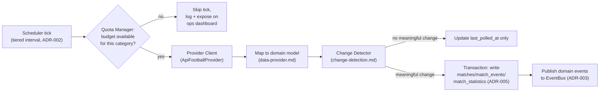

# Ingestion Service

The one component that talks to API-Football. Nothing else in the system
does (§4/§24). Full polling-interval and quota reasoning is in
[ADR-002](adr/ADR-002-polling-strategy.md); provider mapping is in
[data-provider.md](data-provider.md); change detection is its own doc
([change-detection.md](change-detection.md)) because it's substantial
enough to deserve one.

## Pipeline (one poll tick)

## Steps in detail

1. **Fetch.** One or more `SportsDataProvider` calls per tick, per the
   tiered schedule (ADR-002). Every call updates `api:quota` in Redis from
   the response's rate-limit headers, whether or not the call itself
   succeeded.
2. **Respect rate limits.** Before fetching, the scheduler checks the
   relevant category's remaining budget (ADR-002's allocation table). On
   429/5xx, the retry/backoff/circuit-breaker policy from ADR-002 applies;
   a tripped breaker skips the tick entirely rather than blocking.
3. **Cache first.** For anything not on the live-tier path (e.g. an
   on-demand single-match refresh triggered by a cache miss), Redis is
   checked before spending a request — see [caching.md](caching.md).
4. **Map to domain model.** Provider JSON → `Match`/`MatchEvent`/
   `MatchStatistics`/`Standing`, via `ApiFootballProvider` — never stored or
   passed downstream in the provider's own shape.
5. **Detect change.** Compare the mapped result against last-known state
   (Redis first, Postgres fallback) — see [change-detection.md](change-detection.md).
   This is what prevents "the API returned the same match again" from
   generating any event at all.
6. **Persist durably.** On a real change, one Postgres transaction writes
   every affected row (ADR-005) — this happens even if the event bus is
   down, since Postgres is the thing nothing is willing to lose.
7. **Publish events.** Only after the transaction commits, the relevant
   Kafka/Redis-Streams topics (ADR-003) are published to — score changes,
   status changes, new events, statistics updates, each on its own topic.
8. **Update live state.** This step actually happens downstream, in the
   Kafka/Streams consumers (ADR-003), not in the ingestion service itself —
   ingestion's job ends at "durable write + event published." This
   separation is deliberate: ingestion doesn't need to know Redis's key
   schema, and Redis's key schema can change without touching ingestion.

## Failure handling (§22)

| Failure | Behavior |
|---|---|
| Provider down / timeout | Retry with backoff (ADR-002); circuit breaker opens after repeated failures; last-known Postgres/Redis state served with a stale-data indicator (§23) |
| Provider quota exhausted | That category (or all polling, if the safety margin is hit) stops for the rest of the day; system keeps serving last-known state — it does not crash or block other requests |
| Malformed provider response | Mapping step validates required fields; a match that fails validation is logged and skipped for that tick (not retried immediately — it'll be re-attempted next scheduled tick), rather than throwing and killing the scheduler loop |
| Postgres unavailable | The tick's transaction fails; the tick is treated as failed (not partially applied — see ADR-005 on transactional boundaries) and retried next tick; no event is published for a write that didn't durably commit |
| Kafka/Streams unavailable | Postgres write still succeeds (independent step, §7); the event publish is retried a bounded number of times, then logged as a failed event (surfaced on the ops dashboard's "Failed Events" metric, §15) rather than blocking ingestion |
